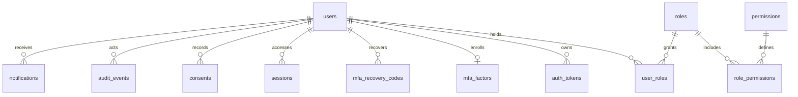
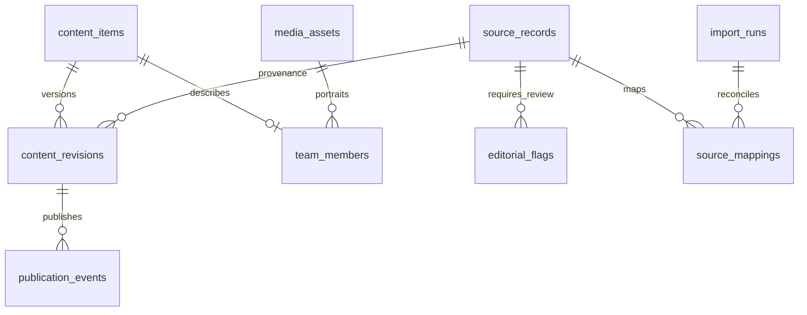
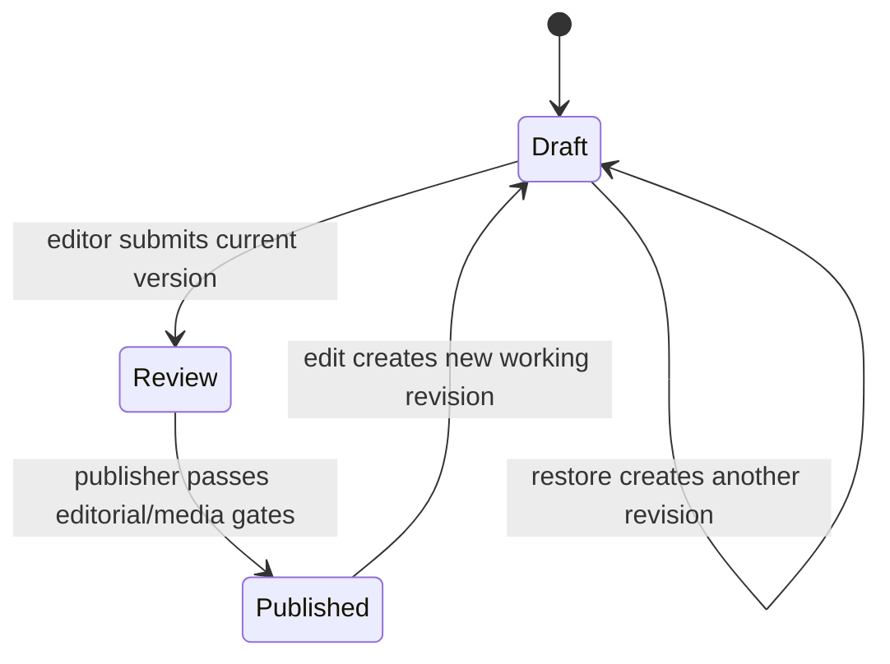

# Foundation architecture

## Decision record

The application is a plain-PHP modular monolith with Twig auto-escaping, PDO/MySQL transactions, explicit domain services/repositories/policies and shared identity. PHP minimum is 8.4; local portable verification uses 8.5.11. MySQL 8.x is required; the local isolated instance uses 8.4.11 on loopback port 3307. Existing XAMPP PHP/MariaDB are not replaced. Composer platform resolution targets PHP 8.4, not the newer local runtime alone.

Composer packages cover routing, HTTP requests/sessions, CLI, validation, sanitization, mail, logs, TOTP and migrations. Phinx introduces CakePHP component dependencies but no CakePHP application framework. Bootstrap provides customized components; Alpine uses the CSP-compatible build. Vite builds static assets, never a production Node server. Lighthouse CLI replaces Lighthouse CI because the latter currently pulls vulnerable unpatched transitive tooling; performance measurement remains required.

## Request flow

`public/index.php → bootstrap/config validation → Kernel → host validation → route/method resolution → CSRF for mutations → domain handler → Twig/JSON → security/cache headers`.

The current foundation exposes only `/health` and an explicitly labelled local development preview at `/`. Production `/` is unavailable until the real public website is implemented. There are no fake login/application routes. Domain authentication/authorization middleware and production pages are not yet implemented. The reusable Policy already requires verification, required privileged MFA and explicit permissions; ownership is a separate check.

Private logs, sessions, quarantine and uploads belong outside `public/`. The root `.htaccess` denies serving the repository, and `public/.htaccess` allows the actual front controller/assets. Use a virtual host whose document root is `public/`; do not weaken root protection to make a subdirectory URL work. The local development router only serves allowlisted compiled asset types beneath `public/build`, not dotfiles or arbitrary source paths. Local XAMPP Apache was checked with HEAD requests: project `.env`, `.runtime/mysql-admin.ini` and source documentation returned 403. Production Apache/cPanel behavior must still be independently verified before deployment.

## Data and transaction boundaries

PDO uses real prepared statements, strict SQL mode, utf8mb4 and UTC. Connection qualification refuses MariaDB and non-8.x engines. Transactions cannot be implicitly nested. Audit/outbox insertions require an active business transaction; rollback removes both the business mutation and its outgoing event. Outbox event keys are unique. External transport workers are a subsequent implementation slice, not yet live delivery.

Phinx forward migrations run under a named MySQL migration lock. Destructive down migrations are intentionally disabled. MySQL DDL commits implicitly: a failed partial migration requires inspection and an approved forward repair, not automatic destructive reruns. Checksums and full release/restore orchestration remain to be implemented.

## Schema relationships implemented in migration 001

`outbox_events` references domain IDs inside constrained event payloads; domain services own authorization. `rate_limit_buckets` stores keyed hashes rather than raw emails/IPs and enforces fixed-window counts transactionally. Database-backed sessions and identity business workflows are not yet wired; the preview uses private native sessions.

## Planned module aggregate ownership

| Module | Aggregate and relationships | Sensitive boundary |
|---|---|---|
| CMS/media | Content → immutable revisions → sections; team; media usages; source mappings | Publisher approval, no operational documents in public media |
| Programs/applications | Program → intakes/forms/rules → applications → assignment/reviews/decisions | Applicant ownership and assigned reviewer scope |
| Participants/startups | User → participant → cohorts/alumni; startup → team/milestones/evidence | Team fields are distinct from personal documents |
| Learning | Course → modules/lessons/resources; participant enrollments/attendance/completion | Enrollment-only access |
| Mentorship | Mentor → accepted matches → scheduled sessions and notes | Assigned participant and explicit note visibility |
| Funding | Round/rule/scorecard versions → applications/reviews → approvals/awards → disbursement entries | Conflict checks, separate actors, transactionally enforced budgets |
| Impact | Indicator versions → observations/evidence/verification → approved report snapshots | Actuals versus targets, provenance and small-cell suppression |
| Partners | Organization/membership → explicit project/report shares; proposal/commitment/receipt | Every access/download rechecks membership and share |
| Community/events | Groups/memberships → posts/comments/moderation; event registrations | Private group isolation, no application-document search |
| Privacy/operations | Requests/retention/holds; jobs/deliveries/exports/backup runs | Restricted administrative scope and approval gates |

These relationships are design commitments. Migrations 002–003 now additionally implement source/import mappings, content items/revisions, team/media records, editorial flags, working review state and publication history. Other domain tables remain pending. CMS and identity/MFA services are being built and tested before their HTTP/UI wiring; this is not a completed CMS or identity portal.

## CMS schema and workflow added in Phase B

The live published revision remains immutable and visible while a new working revision is drafted/reviewed. Restore does not directly republish. The record has separate public lifecycle and working-state fields, with optimistic lock versions incremented for edits, transitions and changed-source imports. Source/editorial flags block publication until the future review interface resolves them with appropriate authority.

## Security rules

No role wildcard or implicit super-admin ownership bypass. Encrypt recoverable secrets with libsodium authenticated encryption and a random 32-byte environment key; password/recovery/token handling will use one-way hashes as appropriate. Do not log raw exceptions, SQL parameters, email bodies, credentials or tokens. Error responses contain only a random request reference. Production and staging require HTTPS, secure cookies and a valid app key. Live mail is off by default and forbidden in the current non-production transport configuration.

## Workflows to enforce in domain services

- CMS: draft → review → published → archived; restoring creates a new draft revision.
- Applications: draft → submitted → screening → under review → shortlist/waitlist/accept/reject; information requests have explicit return states; enrollment is capacity-checked.
- Funding: submitted → reviewed/recommended → authorized approval → awarded; disbursement planned → authorized → recorded. Multi-role accounts cannot bypass self-approval restrictions.
- Impact: draft → submitted → verified → approved for public. Corrections preserve evidence/version history.
- Partner share: explicit grant → accessed → expired/revoked; each download checks current state.
- Jobs: pending → leased processing → completed/retry/dead letter or uncertain external outcome. Do not claim exactly-once SMTP delivery.
